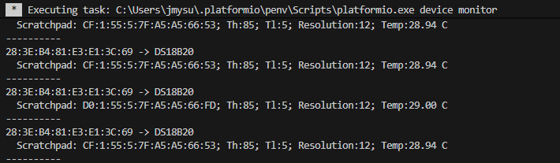
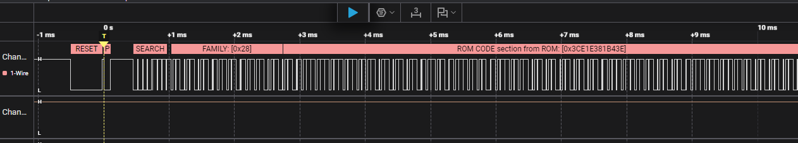

# C3Mini_1wire
OneWire DS18B20 on <ins>C3 super mini</ins>
 
### PlatformIO Monitor  
  
### Logic Analyzer OneWire  
  

 

---
## References  
- [OneWireNG](https://github.com/pstolarz/OneWireNg) OneWireNG Arduino Library Github repository 
- [C3SuperMini-GettingStarted](https://randomnerdtutorials.com/getting-started-esp32-c3-super-mini/) RandomNerd Tutorials (C3-super-mini)  
